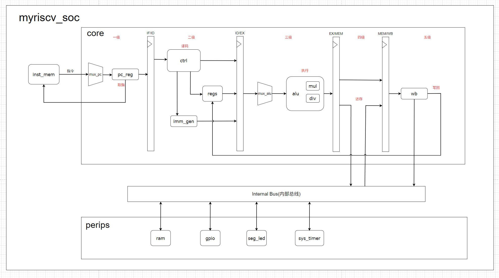

# 基于RISC-V指令集的嵌入式SoC设计与FPGA实现

*FPGA-Verified | 五级流水线设计 | 完整工具链支持*

### 一、🚀核心特性

- **基础指令集支持**

  本处理器严格遵循 **RISC-V 32I** 规范，完整支持以下指令类型：

  | 指令类别 |      典型指令       |         功能描述         |        实现特性        |
  | :------- | :-----------------: | :----------------------: | :--------------------: |
  | 整数运算 | `ADD`, `SUB`, `XOR` | 寄存器-寄存器/立即数运算 |       单周期完成       |
  | 控制流   | `JAL`, `BEQ`, `BGE` |      跳转与分支预测      |      静态分支预测      |
  | 加载存储 |  `LW`, `SW`, `LB`   |        存储器访问        | 哈佛架构(指令数据分离) |

- **M扩展指令集（硬件乘除法）**

  支持 **RV32M** 标准扩展

  ```
  ; M扩展指令示例代码
  MUL    x5, x6, x7    ; 有符号乘法（32x32→32低有效位）
  MULH   x8, x9, x10   ; 有符号乘法高32位结果
  DIVU   x11, x12, x13 ; 无符号整数除法
  REM    x14, x15, x16 ; 有符号余数运算
  ```

  **实现特性**：

  - 乘法器：单周期完成32位乘法
  - 除法器：迭代式32位除法（支持`DIV`/`DIVU`/`REM`/`REMU`）

### 二、⚙️架构概览



### 三、🛠️版本演进

| 版本 |    关键创新    |      资源优化 | 主频提升 |
| :--: | :------------: | ------------: | -------: |
|  v1  |   单周期实现   | 1200 LUT / FF |   10 MHz |
|  v2  | 引入五级流水线 |          +28% |   50 MHz |
| ···  |                |               |          |
|  v9  |    完整SoC     |      4200 LUT |  110 MHz |

### 四、📚文档体系


### 五、📡嵌入式开发库（类STM32标准库）

基于SoC提供**外设驱动库**，支持以下关键功能实现：

|  模块分类  |     功能实现     |    API设计风格     |   典型应用场景    |
| :--------: | :--------------: | :----------------: | :---------------: |
|  GPIO控制  | LED亮灭/按键检测 | `GPIO_ResetBits()` |   板载LED呼吸灯   |
| 数码管驱动 | 动态扫描/BCD解码 | `SEG_WriteData()`  |   温度显示系统    |
|   定时器   |    微秒级延时    |    `TIM_Init()`    | 按键消抖/电机控制 |

**示例代码 - 按键控制LED与数码管**：

```
#include "misc.h"
#include "gpio.h"

int main(void)
{
    GPIO_InitTypeDef GPIO_InitStruct;
    
    // 配置GPIO0为输入模式
    GPIO_InitStruct.GPIO_Pin = GPIO_Pin_0;
    GPIO_InitStruct.GPIO_Mode = GPIO_Mode_IN;
    GPIO_Init(GPIO, &GPIO_InitStruct);

    // 配置GPIO1为输出模式
    GPIO_InitStruct.GPIO_Pin = GPIO_Pin_1;
    GPIO_InitStruct.GPIO_Mode = GPIO_Mode_OUT;
    GPIO_Init(GPIO, &GPIO_InitStruct);

    while(1) {
        if (GPIO_ReadInputDataBit(GPIO, GPIO_Pin_0)) {
            GPIO_ResetBits(GPIO, GPIO_Pin_1);
        } else {
            GPIO_SetBits(GPIO, GPIO_Pin_1);
        }
        Delay(100000);  // 简单延时
    }
}
```

