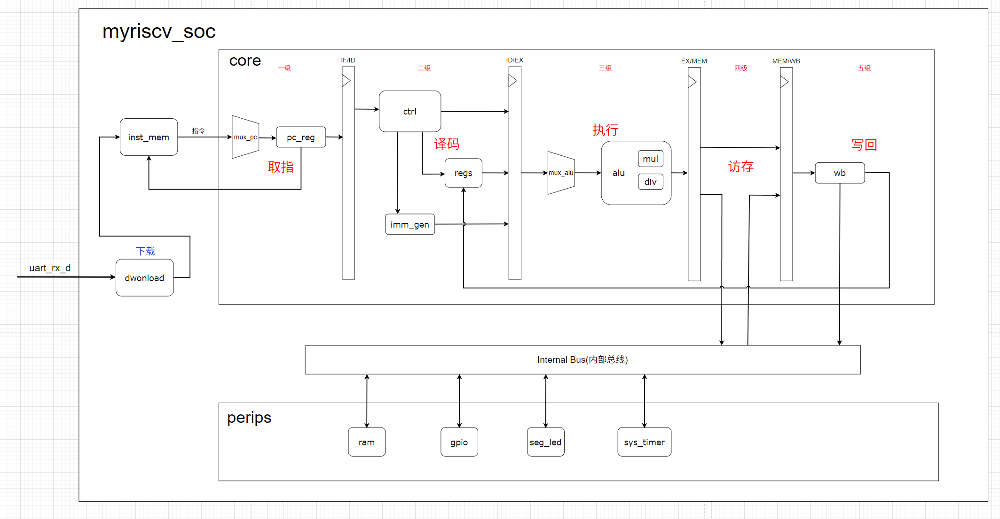

# 基于RISC-V指令集的嵌入式SoC设计与FPGA实现

*FPGA-Verified | 五级流水线设计 | 完整工具链支持*

### 一、🚀核心特性

- **基础指令集支持**

  本处理器严格遵循 **RISC-V 32I** 规范，完整支持以下指令类型：

  | 指令类别 |      典型指令       |         功能描述         |        实现特性        |
  | :------- | :-----------------: | :----------------------: | :--------------------: |
  | 整数运算 | `ADD`, `SUB`, `XOR` | 寄存器-寄存器/立即数运算 |       单周期完成       |
  | 控制流   | `JAL`, `BEQ`, `BGE` |      跳转与分支预测      |      静态分支预测      |
  | 加载存储 |  `LW`, `SW`, `LB`   |        存储器访问        | 哈佛架构(指令数据分离) |

- **M扩展指令集（硬件乘除法）**

  支持 **RV32M** 标准扩展

  ```
  ; M扩展指令示例代码
  MUL    x5, x6, x7    ; 有符号乘法（32x32→32低有效位）
  MULH   x8, x9, x10   ; 有符号乘法高32位结果
  DIVU   x11, x12, x13 ; 无符号整数除法
  REM    x14, x15, x16 ; 有符号余数运算
  ```

  **实现特性**：

  - 乘法器：单周期完成32位乘法
  - 除法器：迭代式32位除法（支持`DIV`/`DIVU`/`REM`/`REMU`）

### 二、⚙️架构概览



### 三、📺成果展示

### 📽️ 视频一：RISC-V SoC指令集测试仿真

视频聚焦硬件核心验证完整展示了**RISC-V指令集的硬件验证流程**，以ADD指令为例进行深度演示。

[](https://www.bilibili.com/video/BV1AmGWzQEgd/?share_source=copy_web&vd_source=8cff0e6714fe99d1316c9498f7133138)

点击上面图片即可跳转播放视频（视频链接：https://www.bilibili.com/video/BV1AmGWzQEgd/?share_source=copy_web&vd_source=8cff0e6714fe99d1316c9498f7133138 ）


### 📽️ 视频二：RISC-V SoC嵌入式开发测试

视频展示了完整的嵌入式开发链：从C语言编写外设驱动（GPIO/定时器/数码管），到Makefile自动化编译、链接脚本定制内存布局，最终通过串口下载实现——按键控制LED、定时器、LED状态翻转和数码管动态显示（0.00-9.99）例程，充分验证了SoC的实用性和开发便捷性。

[](https://www.bilibili.com/video/BV17JGAznEnj/?share_source=copy_web&vd_source=8cff0e6714fe99d1316c9498f7133138)

点击上面图片即可跳转播放视频（视频链接：https://www.bilibili.com/video/BV17JGAznEnj/?share_source=copy_web&vd_source=8cff0e6714fe99d1316c9498f7133138 ）


两个视频共同构成了从指令集到应用层的闭环验证，体现了五级流水线设计的稳定性和外设集成能力。

### 四、🛠️版本演进

| 版本 |                           关键创新                           |       资源优化       | 主频提升 |
| :--: | :----------------------------------------------------------: | :------------------: | :------: |
|  v1  |                          单周期实现                          | 22000 LUT / 13250 FF |  10 MHz  |
|  v2  |                        引入五级流水线                        |          -           |  50 MHz  |
|  v3  |        引入GPIO、RAM、总线控制器模块<br />进行SoC设计        |          -           |  50MHz   |
|  v4  | 使用汇编语言编写按键控制LED灯程序<br />并在开发板上成功运行  |          -           |  50MHz   |
|  v5  |        搭建RISCV交叉编译环境<br />修改地址空间映射表         |          -           |  50MHz   |
|  v6  | 扩展GPIO外设宽度<br />编写八段数码管外设RTL文件和设计说明书<br />编写GPIO、SEG_LED外设标准库 |          -           |  50MHz   |
|  v7  |            引入系统定时器模块<br />编写标准库函数            |          -           |  50MHz   |
|  v8  |                 增加对M乘法扩展指令集的支持                  |          -           |  50MHz   |
|  v9  |                       完善整体SoC设计                        |  7672 LUT / 4810 FF  | 110 MHz  |
| v10  |                      为SoC增加下载功能                       |          -           |    -     |

### 五、📡嵌入式开发库（类STM32标准库）

基于SoC提供**外设驱动库**，支持以下关键功能实现：

|  模块分类  |     功能实现     |    API设计风格     |   典型应用场景    |
| :--------: | :--------------: | :----------------: | :---------------: |
|  GPIO控制  | LED亮灭/按键检测 | `GPIO_ResetBits()` |   板载LED呼吸灯   |
| 数码管驱动 | 动态扫描/BCD解码 | `SEG_WriteData()`  |   温度显示系统    |
|   定时器   |    微秒级延时    |    `TIM_Init()`    | 按键消抖/电机控制 |

**示例代码 - 按键控制LED与数码管**：

```
#include "misc.h"
#include "gpio.h"

int main(void)
{
    GPIO_InitTypeDef GPIO_InitStruct;
    
    // 配置GPIO0为输入模式
    GPIO_InitStruct.GPIO_Pin = GPIO_Pin_0;
    GPIO_InitStruct.GPIO_Mode = GPIO_Mode_IN;
    GPIO_Init(GPIO, &GPIO_InitStruct);

    // 配置GPIO1为输出模式
    GPIO_InitStruct.GPIO_Pin = GPIO_Pin_1;
    GPIO_InitStruct.GPIO_Mode = GPIO_Mode_OUT;
    GPIO_Init(GPIO, &GPIO_InitStruct);

    while(1) {
        if (GPIO_ReadInputDataBit(GPIO, GPIO_Pin_0)) {
            GPIO_ResetBits(GPIO, GPIO_Pin_1);
        } else {
            GPIO_SetBits(GPIO, GPIO_Pin_1);
        }
        Delay(100000);  // 简单延时
    }
}
```

### 六、📚文档体系

```
D:.
├─.vscode
├─docs				# 包括RISC-V官方文档，SoC外设开发设计方案，学习笔记等
├─img				# 图片资源
├─lib				# 为SoC编写的类STM32标准库函数
├─tests				# 指令集测试文件夹
│  └─inst				# 十六进制指令文件
│      └─dump			# 反汇编文件
└─versions	 		# 历史版本存档（保留完整开发记录）
    ├─v1
    │  ├─sim		# 仿真文件
    │  └─src		# 该版本的Verilog源码
    │      └─core	# 核心模块
   ···
    ├─v8
    │  ├─cons		# 约束文件
    │  ├─sim
    │  └─src
    │      ├─bus		# 总线模块
    │      ├─core	
    │      ├─mul_div	# 乘除法模块
    │      └─perips		# 外设模块
    └─v9
        ├─cons
        ├─sim
        └─src
            ├─bus
            ├─core
            ├─mul_div
            └─perips
```

